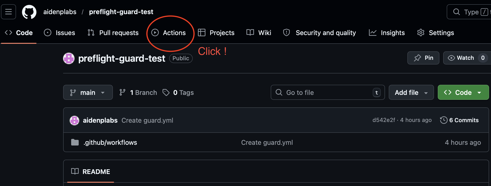
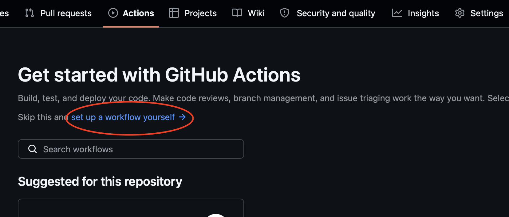
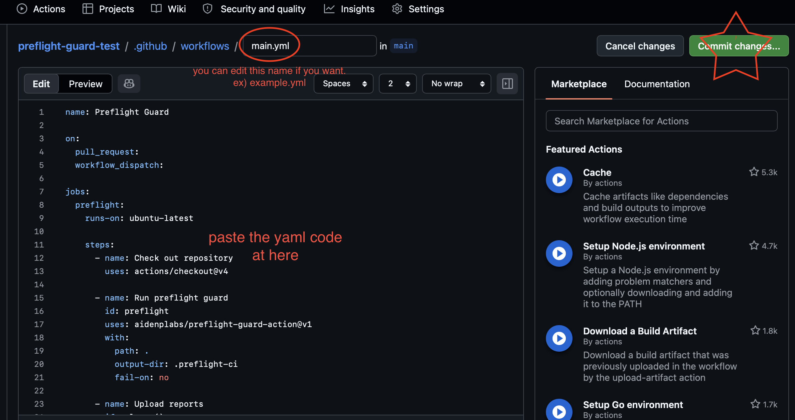
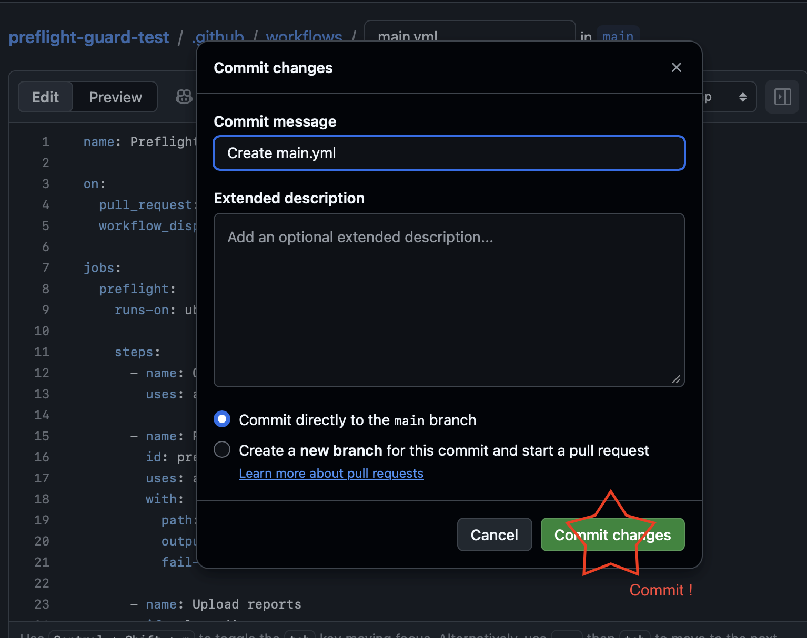
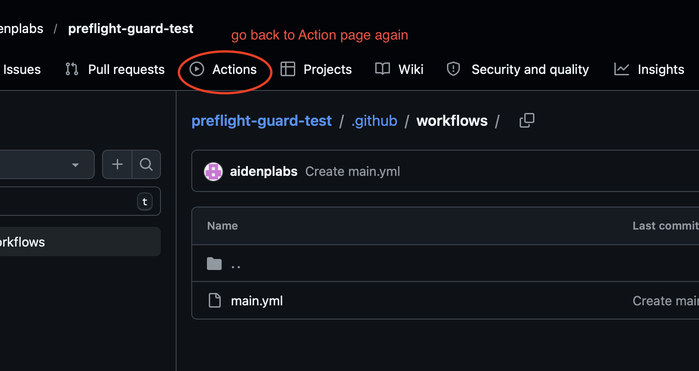
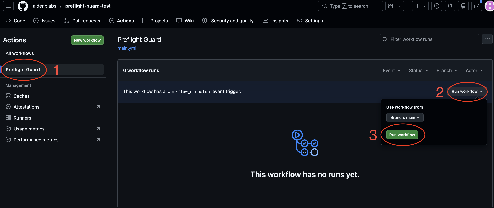
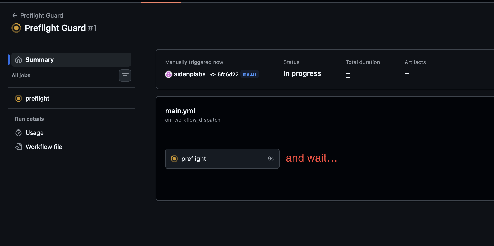
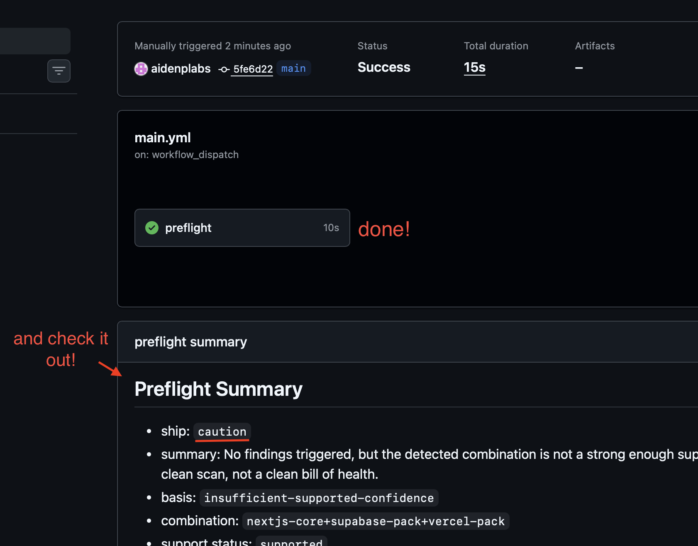

# How To Use Preflight Guard! 
## beginner friendly version

! This guide shows the easiest way to try Preflight Guard in your own GitHub repository.

! You do not need to fork or clone the Preflight Guard repo.
! You only need to add one GitHub Actions workflow file in your own repository.

<br>

## step 0. Copy the below yaml file.

<br>

```yaml
name: Preflight Guard

on:
  pull_request:
  workflow_dispatch:

jobs:
  preflight:
    runs-on: ubuntu-latest

    steps:
      - name: Check out repository
        uses: actions/checkout@v4

      - name: Run preflight guard
        id: preflight
        uses: aidenplabs/preflight-guard-action@v1
        with:
          path: .
          output-dir: .preflight-ci
          fail-on: no

      - name: Upload reports
        if: always()
        uses: actions/upload-artifact@v4
        with:
          name: preflight-report
          path: .preflight-ci/
```


<br>

## step 1. Open your own GitHub repository and click the Actions tab.

- This is where you can create and run GitHub Actions workflows.

<br>




<br>

## Step 2. Click "set up a workflow yourself"

- If this is your first workflow in the repo, GitHub will show a setup screen.
Click the link to create your own workflow file.

<br>




<br>

## Step 3. Add .yml file and commit

- You can keep the file name as main.yml if you want, or rename it to something like preflight.yml.

- Paste the YAML from Step 0 into the editor.

- Click Commit changes... in the top right.

- Then commit the file directly to your main branch, or use a pull request if you prefer.

<br>



<br>




<br>

## Step 4. Go back to the Actions page

- After the workflow file is committed, go back to the Actions tab.
You should now see the new workflow in the left sidebar.

<br>




<br>

## Step 5. Run the workflow

- Click the workflow name in the left sidebar.

- Then:
  1. click Run workflow
  2. choose the branch if needed
  3. click Run workflow(green)

- and.. wait for the run to finish...

<br>



<br>




<br>

## Step 6. Check out your result !

<br>




<br>
   
